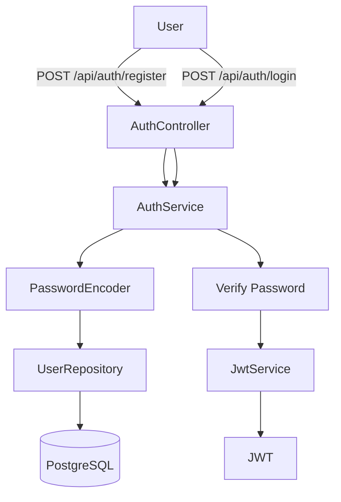
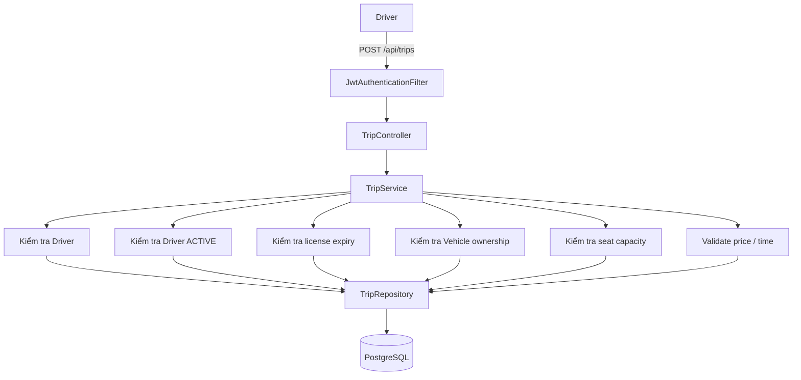
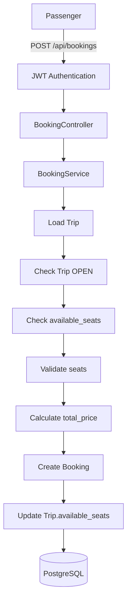
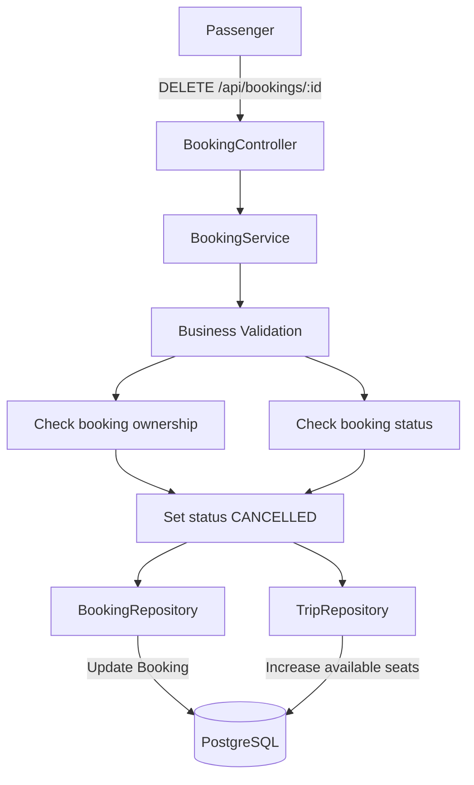
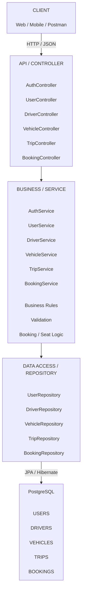
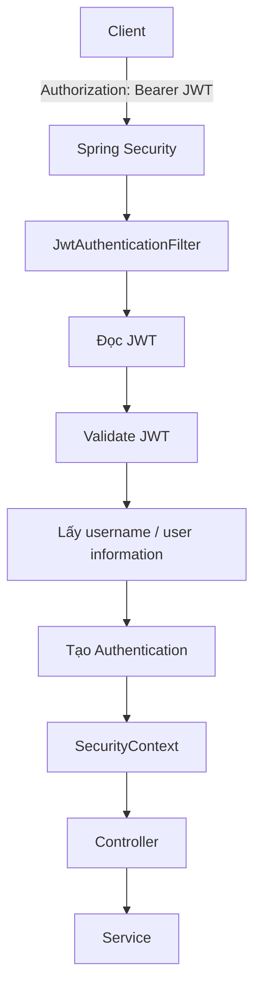

# CARPOOL BOOKING SYSTEM
## Tài liệu đặc tả yêu cầu và kiến trúc hệ thống

## Mục lục

- [1. Tổng quan và phạm vi hệ thống](#1-tổng-quan-và-phạm-vi-hệ-thống)
  - [1.1. Mục tiêu hệ thống](#11-mục-tiêu-hệ-thống)
  - [1.2. Phạm vi hệ thống](#12-phạm-vi-hệ-thống)
  - [1.3. Actor và vai trò](#13-actor-và-vai-trò)
- [2. Yêu cầu và nghiệp vụ](#2-yêu-cầu-và-nghiệp-vụ)
  - [2.1. Đặc tả yêu cầu chức năng](#21-đặc-tả-yêu-cầu-chức-năng)
  - [2.2. Business Rules tổng hợp](#22-business-rules-tổng-hợp)
  - [2.3. Luồng nghiệp vụ chính](#23-luồng-nghiệp-vụ-chính)
- [3. Thiết kế database](#3-thiết-kế-database)
  - [3.1. Đặc tả dữ liệu](#31-đặc-tả-dữ-liệu)
  - [3.2. ERD logic](#32-erd-logic)
  - [3.3. Database Migration](#33-database-migration)
- [4. Kiến trúc hệ thống](#4-kiến-trúc-hệ-thống)
  - [4.1. Kiến trúc tổng thể](#41-kiến-trúc-tổng-thể)
  - [4.2. Security Architecture](#42-security-architecture)
  - [4.3. Phân quyền API](#43-phân-quyền-api)
- [5. Thiết kế API](#5-thiết-kế-api)
  - [5.1. Authentication](#51-authentication)
  - [5.2. Users](#52-users)
  - [5.3. Drivers](#53-drivers)
  - [5.4. Vehicles](#54-vehicles)
  - [5.5. Trips](#55-trips)
  - [5.6. Bookings](#56-bookings)
  - [5.7. Bảng tổng hợp API](#57-bảng-tổng-hợp-api)
- [6. Thiết kế mã nguồn](#6-thiết-kế-mã-nguồn)
  - [6.1. Cấu trúc project](#61-cấu-trúc-project)
  - [6.2. Trách nhiệm của từng layer](#62-trách-nhiệm-của-từng-layer)
  - [6.3. DTO Architecture](#63-dto-architecture)
  - [6.4. Exception Handling](#64-exception-handling)
- [7. Yêu cầu phi chức năng](#7-yêu-cầu-phi-chức-năng)
- [8. Tiêu chí hoàn thành pha 1](#8-tiêu-chí-hoàn-thành-pha-1)
  - [8.1. Tiêu chí hoàn thành](#81-tiêu-chí-hoàn-thành)
  - [8.2. Tóm tắt kiến trúc](#82-tóm-tắt-kiến-trúc)
- [9. Phân chia công việc](#9-phân-chia-công-việc)

---

# 1. Tổng quan và phạm vi hệ thống
### Hệ thống cho phép:

- Người dùng đăng ký và đăng nhập.
- Người dùng có vai trò `PASSENGER`, `DRIVER` hoặc `ADMIN`.
- Tài xế quản lý hồ sơ tài xế và phương tiện.
- Tài xế tạo và quản lý các chuyến xe.
- Hành khách tìm kiếm chuyến xe theo điểm đi, điểm đến và thời gian.
- Hành khách đặt một hoặc nhiều ghế trên chuyến xe.
- Hành khách hủy booking.
- Hệ thống tự động cập nhật số ghế còn trống.
- API được bảo vệ bằng JWT và Spring Security.
- Swagger/OpenAPI được sử dụng để mô tả và kiểm thử API.

---
## 1.1. Mục tiêu hệ thống
### 1.1.1. Mục tiêu nghiệp vụ

Hệ thống nhằm cung cấp một nền tảng đơn giản để:

1. Tài xế đăng chuyến xe và số ghế còn bán.
2. Hành khách tìm kiếm chuyến xe phù hợp.
3. Hành khách đặt chỗ và cung cấp địa chỉ đón/trả.
4. Hệ thống kiểm soát số ghế còn lại.
5. Hệ thống lưu lịch sử đặt chỗ.
6. Phân quyền các chức năng theo vai trò người dùng.

### 1.1.2. Mục tiêu kỹ thuật

Hệ thống phải:

- Cung cấp RESTful JSON API.
- Tách biệt Controller, Business Service và Data Access.
- Không đặt logic nghiệp vụ trực tiếp trong Controller.
- Sử dụng Repository để truy cập database.
- Sử dụng DTO để trao đổi dữ liệu API.
- Sử dụng JWT để xác thực.
- Xác thực JWT thông qua Spring Security Filter thay vì lặp lại logic trong từng endpoint.
- Mật khẩu phải được hash bằng bcrypt hoặc Argon2.
- Có xử lý exception tập trung.
- Có Swagger/OpenAPI.
- Có migration database.
- Có đóng gói và chạy bằng Docker ở giai đoạn triển khai.

---
---
## 1.2. Phạm vi hệ thống

#### Authentication
- Đăng ký tài khoản.
- Đăng nhập.
- Sinh JWT.
- Xác thực JWT.
- Phân quyền theo role.

#### User
- Xem thông tin tài khoản.
- Cập nhật thông tin cá nhân.

#### Driver
- Tạo hồ sơ tài xế.
- Xem hồ sơ tài xế.
- Cập nhật hồ sơ tài xế.
- Quản lý trạng thái hoạt động.

#### Vehicle
- Thêm phương tiện.
- Xem phương tiện.
- Cập nhật phương tiện.
- Quản lý phương tiện thuộc tài xế.

#### Trip
- Tài xế tạo chuyến.
- Xem chuyến.
- Tìm kiếm chuyến.
- Cập nhật chuyến.
- Hủy chuyến / thay đổi trạng thái chuyến.

#### Booking
- Hành khách đặt ghế.
- Xem booking.
- Hủy booking.
- Cập nhật số ghế còn lại.

#### Administration
- Quản lý người dùng/tài xế theo quyền ADMIN.
- Có thể mở rộng kiểm duyệt tài xế hoặc khóa tài khoản ở giai đoạn sau.

---
---
## 1.3. Actor và vai trò
| Actor | Mô tả |
|---|---|
| Passenger | Hành khách sử dụng hệ thống để tìm và đặt chuyến |
| Driver | Tài xế tạo chuyến và quản lý phương tiện |
| Admin | Quản trị hệ thống |

### 1.3.1. Passenger

Passenger có thể:

- Đăng ký.
- Đăng nhập.
- Xem/cập nhật thông tin cá nhân.
- Tìm kiếm chuyến.
- Xem chi tiết chuyến.
- Đặt ghế.
- Xem booking của mình.
- Hủy booking.

### 1.3.2. Driver

Driver có thể:

- Đăng nhập.
- Quản lý hồ sơ tài xế.
- Quản lý phương tiện.
- Tạo chuyến.
- Xem chuyến của mình.
- Cập nhật chuyến.
- Hủy chuyến theo quy tắc nghiệp vụ.

### 1.3.3. Admin

Admin có thể:

- Quản lý người dùng.
- Quản lý tài xế.
- Kiểm soát trạng thái tài khoản/tài xế.
- Thực hiện các thao tác quản trị được hệ thống cho phép.

---
---
# 2. Yêu cầu và nghiệp vụ
## 2.1. Đặc tả yêu cầu chức năng
### FR-01. Đăng ký

**Endpoint:** `POST /api/auth/register`

Input tối thiểu:

- name
- email
- password
- phone
- role

Business rules:

- Email không được trùng.
- Password không được lưu dạng plaintext.
- Password phải được hash bằng bcrypt/Argon2.
- Role phải thuộc tập role được hệ thống hỗ trợ.
- Thông tin không hợp lệ phải trả về lỗi 4xx phù hợp.

Output:

- Thông tin user đã tạo hoặc response phù hợp.

---

### FR-02. Đăng nhập

**Endpoint:** `POST /api/auth/login`

Input:

- email
- password

Processing:

1. Tìm user theo email.
2. Kiểm tra password.
3. Kiểm tra trạng thái/quyền nếu cần.
4. Tạo JWT.
5. Trả JWT cho client.

Output:

```json
{
  "token": "jwt-token",
  "type": "Bearer"
}
```

---

### FR-03. Xác thực request

Các endpoint yêu cầu đăng nhập phải nhận:

```http
Authorization: Bearer <JWT>
```

JWT được xử lý bởi:

```text
JwtAuthenticationFilter
        ↓
JwtService
        ↓
Spring SecurityContext
        ↓
Controller
```

Controller không tự parse JWT và không lặp lại logic xác thực.

---

### FR-04. Quản lý người dùng

Các chức năng chính:

- Lấy thông tin người dùng.
- Cập nhật thông tin.
- Quản lý người dùng đối với ADMIN.

Ví dụ:

```http
GET /api/users/me
PUT /api/users/me
```

---

### FR-05. Quản lý hồ sơ tài xế

Driver có hồ sơ riêng trong bảng `DRIVERS`.

Thông tin gồm:

- user_id
- license_number
- license_expiry
- status

Business rules:

- Một user chỉ có tối đa một hồ sơ driver.
- license_number phải duy nhất.
- Driver phải có trạng thái `ACTIVE` mới được mở chuyến.
- Không được mở chuyến nếu giấy phép lái xe đã hết hạn.

---

### FR-06. Quản lý phương tiện

Vehicle gồm:

- driver_id
- license_plate
- brand
- model
- seat_capacity

Business rules:

- Biển số xe phải duy nhất.
- Vehicle phải thuộc một Driver.
- `seat_capacity` phải lớn hơn 0.
- Khi tạo Trip, `total_seats` không được lớn hơn `seat_capacity`.

---

### FR-07. Tạo chuyến xe

**Endpoint:** `POST /api/trips`

Driver cung cấp:

- vehicle_id
- origin
- destination
- departure_time
- total_seats
- price

Hệ thống tự thiết lập:

```text
available_seats = total_seats
status = OPEN
```

Business rules:

1. User phải đăng nhập.
2. User phải có role DRIVER.
3. Driver phải tồn tại.
4. Driver phải `ACTIVE`.
5. License chưa hết hạn.
6. Vehicle phải thuộc Driver.
7. `total_seats <= vehicle.seat_capacity`.
8. `price > 0`.
9. `departure_time` phải hợp lệ.

---

### FR-08. Tìm kiếm chuyến

**Endpoint:** `GET /api/trips`

Các tham số có thể gồm:

```text
origin
destination
departureDate
```

Ví dụ:

```http
GET /api/trips?origin=Hanoi&destination=Nam%20Dinh
```

Kết quả chỉ nên trả về các chuyến phù hợp với điều kiện tìm kiếm và trạng thái có thể đặt.

---

### FR-09. Cập nhật chuyến

**Endpoint:** `PUT /api/trips/{id}`

Chỉ Driver sở hữu chuyến hoặc ADMIN được phép thực hiện theo policy của hệ thống.

Không được cập nhật tùy tiện các dữ liệu lịch sử của booking đã tồn tại.

Đặc biệt:

- Thay đổi giá chuyến không được làm thay đổi `BOOKINGS.total_price`.
- `BOOKINGS.total_price` phải giữ nguyên giá tại thời điểm booking.

---

### FR-10. Đặt booking

**Endpoint:** `POST /api/bookings`

Input:

- trip_id
- pickup_address
- dropoff_address
- seats

Processing:

```text
Kiểm tra Trip
      ↓
Kiểm tra status
      ↓
Kiểm tra available_seats
      ↓
Tính total_price
      ↓
Tạo Booking
      ↓
Giảm available_seats
      ↓
Nếu available_seats = 0 → status = FULL
```

Công thức:

```text
total_price = seats × trip.price
```

Business rules:

- User phải đăng nhập.
- User phải có quyền Passenger.
- Trip phải ở trạng thái `OPEN`.
- `seats > 0`.
- `seats <= available_seats`.
- Pickup/dropoff không được rỗng.
- Không được đặt chuyến đã đầy hoặc đã hủy.

---

### FR-11. Hủy booking

**Endpoint:** `DELETE /api/bookings/{id}`

Đây là **Soft Delete**.

Không xóa vật lý bản ghi booking.

Thay vào đó:

```text
status = CANCELLED
```

Sau đó:

```text
trip.available_seats += booking.seats
```

Nếu chuyến trước đó là `FULL`, chuyến có thể chuyển lại:

```text
FULL → OPEN
```

---
---
## 2.2. Business Rules tổng hợp
| ID | Business Rule |
|---|---|
| BR-01 | Email user phải UNIQUE |
| BR-02 | Password phải được hash |
| BR-03 | Mỗi user tối đa một Driver profile |
| BR-04 | License number phải UNIQUE |
| BR-05 | License phải còn hạn khi Driver mở Trip |
| BR-06 | Driver phải ACTIVE để mở Trip |
| BR-07 | Vehicle phải thuộc Driver tạo Trip |
| BR-08 | Total seats không vượt quá vehicle seat capacity |
| BR-09 | Khi tạo Trip, available seats = total seats |
| BR-10 | Chỉ Trip OPEN mới nhận booking |
| BR-11 | Số ghế booking không vượt available seats |
| BR-12 | Total booking price = seats × trip price |
| BR-13 | Booking lưu total_price để giữ giá lịch sử |
| BR-14 | Hủy booking dùng Soft Delete |
| BR-15 | Hủy booking phải hoàn lại số ghế |
| BR-16 | available_seats = 0 thì Trip chuyển FULL |
| BR-17 | JWT được xác thực tập trung bởi Spring Security Filter |

---
---
## 2.3. Luồng nghiệp vụ chính
### 2.3.1. Luồng đăng ký / đăng nhập



---

### 2.3.2. Luồng tài xế tạo chuyến



---

### 2.3.3. Luồng đặt chỗ



Nên thực hiện thao tác tạo booking và giảm số ghế trong cùng một transaction để tránh trạng thái dữ liệu không đồng nhất.

---

### 2.3.4. Luồng hủy booking



---
---
# 3. Thiết kế database
## 3.1. Đặc tả dữ liệu
### 3.1.1. USERS

| Field | Type | Constraint |
|---|---|---|
| id | BIGINT | PK, Auto Increment |
| name | VARCHAR(100) | NOT NULL |
| email | VARCHAR(150) | UNIQUE, NOT NULL |
| password | VARCHAR(255) | NOT NULL |
| phone | VARCHAR(20) | NOT NULL |
| role | VARCHAR(20) | NOT NULL |
| created_at | TIMESTAMP | DEFAULT CURRENT_TIMESTAMP |

`role`:

```text
PASSENGER
DRIVER
ADMIN
```

---

### 3.1.2. DRIVERS

| Field | Type | Constraint |
|---|---|---|
| id | BIGINT | PK |
| user_id | BIGINT | FK, UNIQUE |
| license_number | VARCHAR(50) | UNIQUE, NOT NULL |
| license_expiry | DATE | NOT NULL |
| status | VARCHAR(20) | NOT NULL |
| created_at | TIMESTAMP | DEFAULT CURRENT_TIMESTAMP |

`status`:

```text
ACTIVE
INACTIVE
```

Quan hệ:

```text
USERS 1 ───── 1 DRIVERS
```

---

### 3.1.3. VEHICLES

| Field | Type | Constraint |
|---|---|---|
| id | BIGINT | PK |
| driver_id | BIGINT | FK |
| license_plate | VARCHAR(20) | UNIQUE, NOT NULL |
| brand | VARCHAR(50) | NOT NULL |
| model | VARCHAR(50) | NOT NULL |
| seat_capacity | INT | NOT NULL |
| created_at | TIMESTAMP | DEFAULT CURRENT_TIMESTAMP |

Quan hệ:

```text
DRIVERS 1 ───── N VEHICLES
```

---

### 3.1.4. TRIPS

| Field | Type | Constraint |
|---|---|---|
| id | BIGINT | PK |
| driver_id | BIGINT | FK |
| vehicle_id | BIGINT | FK |
| origin | VARCHAR(100) | NOT NULL |
| destination | VARCHAR(100) | NOT NULL |
| departure_time | TIMESTAMP | NOT NULL |
| total_seats | INT | NOT NULL |
| available_seats | INT | NOT NULL |
| price | DECIMAL(10,2) | NOT NULL |
| status | VARCHAR(20) | NOT NULL |
| created_at | TIMESTAMP | DEFAULT CURRENT_TIMESTAMP |

`status`:

```text
OPEN
FULL
COMPLETED
CANCELLED
```

Quan hệ:

```text
DRIVERS 1 ───── N TRIPS
VEHICLES 1 ──── N TRIPS
```

---

### 3.1.5. BOOKINGS

| Field | Type | Constraint |
|---|---|---|
| id | BIGINT | PK |
| trip_id | BIGINT | FK |
| passenger_id | BIGINT | FK |
| pickup_address | VARCHAR(255) | NOT NULL |
| dropoff_address | VARCHAR(255) | NOT NULL |
| seats | INT | NOT NULL |
| total_price | DECIMAL(10,2) | NOT NULL |
| status | VARCHAR(20) | NOT NULL |
| created_at | TIMESTAMP | DEFAULT CURRENT_TIMESTAMP |

`status`:

```text
CONFIRMED
CANCELLED
```

Quan hệ:

```text
TRIPS 1 ───── N BOOKINGS
USERS 1 ───── N BOOKINGS
```

---
---
## 3.2. ERD logic
```text
                 ┌───────────────┐
                 │     USERS     │
                 │───────────────│
                 │ PK id         │
                 │ name          │
                 │ email         │
                 │ password      │
                 │ phone         │
                 │ role          │
                 └───────┬───────┘
                         │
                    1    │    1
                         │
                 ┌───────▼───────┐
                 │    DRIVERS    │
                 │───────────────│
                 │ PK id         │
                 │ FK user_id    │
                 │ license_no    │
                 │ expiry        │
                 │ status        │
                 └───┬───────┬───┘
                     │       │
                   1 │       │ 1
                     │       │
                   N │       │ N
             ┌───────▼───┐ ┌─▼────────────┐
             │ VEHICLES  │ │    TRIPS     │
             │───────────│ │──────────────│
             │ PK id     │ │ PK id        │
             │ FK driver │ │ FK driver_id │
             │ plate     │ │ FK vehicle   │
             │ brand     │ │ origin       │
             │ model     │ │ destination  │
             │ seats     │ │ departure    │
             └───────────┘ │ price        │
                           │ available    │
                           │ status       │
                           └──────┬───────┘
                                  │
                                1 │
                                  │ N
                           ┌──────▼───────┐
                           │   BOOKINGS   │
                           │──────────────│
                           │ PK id        │
                           │ FK trip_id   │
                           │ FK passenger │
                           │ pickup       │
                           │ dropoff      │
                           │ seats        │
                           │ total_price  │
                           │ status       │
                           └──────────────┘
```

---
---
## 3.3. Database Migration
Migration được quản lý theo version:

```text
V1__create_users.sql
V2__create_drivers.sql
V3__create_vehicles.sql
V4__create_trips.sql
V5__create_bookings.sql
```

Thứ tự phụ thuộc:

```text
USERS
  ↓
DRIVERS
  ↓
VEHICLES
  ↓
TRIPS
  ↓
BOOKINGS
```

---
---
# 4. Kiến trúc hệ thống
## 4.1. Kiến trúc tổng thể

Hệ thống sử dụng **Kiến trúc 4 lớp** cho pha 1:

## Kiến trúc hệ thống



---
---
## 4.2. Security Architecture
Authentication được xử lý tập trung bằng Spring Security.



### Thành phần security

#### JwtService

Chịu trách nhiệm:

- Generate JWT.
- Extract username/email.
- Validate JWT.
- Kiểm tra token hợp lệ.

#### JwtAuthenticationFilter

Chạy trước Controller để:

- Đọc header Authorization.
- Extract Bearer token.
- Validate token.
- Đưa authentication vào SecurityContext.

#### CustomUserDetailsService

Chịu trách nhiệm load user từ database để Spring Security xác thực.

#### PasswordEncoderConfig

Cung cấp PasswordEncoder để hash/verify password.

#### SecurityConfig

Cấu hình:

- Public endpoints.
- Protected endpoints.
- Role-based authorization.
- JWT filter.

---
---
## 4.3. Phân quyền API
| API | Guest | Passenger | Driver | Admin |
|---|---:|---:|---:|---:|
| POST `/api/auth/register` | ✓ | ✓ | ✓ | ✓ |
| POST `/api/auth/login` | ✓ | ✓ | ✓ | ✓ |
| GET `/api/trips` | ✓ | ✓ | ✓ | ✓ |
| GET `/api/trips/{id}` | ✓ | ✓ | ✓ | ✓ |
| POST `/api/bookings` | ✗ | ✓ | ✗/theo policy | Admin policy |
| DELETE `/api/bookings/{id}` | ✗ | ✓ | ✗/theo policy | Admin policy |
| POST `/api/trips` | ✗ | ✗ | ✓ | ✓ |
| PUT `/api/trips/{id}` | ✗ | ✗ | Owner | ✓ |
| POST `/api/vehicles` | ✗ | ✗ | ✓ | ✓ |
| PUT `/api/vehicles/{id}` | ✗ | ✗ | Owner | ✓ |
| GET `/api/users/me` | ✗ | ✓ | ✓ | ✓ |

Quyền cụ thể có thể được triển khai bằng Spring Security authorization rules và/hoặc method-level authorization.

---
---
# 5. Thiết kế API
### 5.1. Authentication

#### Register

```http
POST /api/auth/register
Content-Type: application/json
```

Request:

```json
{
  "name": "Nguyen Van A",
  "email": "a@example.com",
  "password": "12345678",
  "phone": "0900000000",
  "role": "PASSENGER"
}
```

#### Login

```http
POST /api/auth/login
Content-Type: application/json
```

Request:

```json
{
  "email": "a@example.com",
  "password": "12345678"
}
```

---

### 5.2. Users

```http
GET /api/users/me
PUT /api/users/me
```

Protected bằng JWT.

---

### 5.3. Drivers

```http
POST /api/drivers
GET /api/drivers/{id}
PUT /api/drivers/{id}
```

Driver profile được liên kết với `USERS.id`.

---

### 5.4. Vehicles

```http
POST /api/vehicles
GET /api/vehicles/{id}
PUT /api/vehicles/{id}
DELETE /api/vehicles/{id}
```

---

### 5.5. Trips

```http
POST /api/trips
GET /api/trips
GET /api/trips/{id}
PUT /api/trips/{id}
DELETE /api/trips/{id}
```

Search parameters:

```text
origin
destination
departureDate
```

---

### 5.6. Bookings

```http
POST /api/bookings
GET /api/bookings/{id}
GET /api/bookings/my
DELETE /api/bookings/{id}
```

### 5.7. Bảng tổng hợp API

| STT | Module | Method | Endpoint | Authentication | Mô tả |
|---:|---|---|---|---|---|
| 1 | Authentication | POST | `/api/auth/register` | Không | Đăng ký tài khoản |
| 2 | Authentication | POST | `/api/auth/login` | Không | Đăng nhập và nhận JWT |
| 3 | Users | GET | `/api/users/me` | JWT | Lấy thông tin người dùng hiện tại |
| 4 | Users | PUT | `/api/users/me` | JWT | Cập nhật thông tin người dùng |
| 5 | Drivers | POST | `/api/drivers` | JWT | Tạo hồ sơ tài xế |
| 6 | Drivers | GET | `/api/drivers/{id}` | JWT | Lấy thông tin hồ sơ tài xế |
| 7 | Drivers | PUT | `/api/drivers/{id}` | JWT | Cập nhật hồ sơ tài xế |
| 8 | Vehicles | POST | `/api/vehicles` | JWT | Thêm phương tiện |
| 9 | Vehicles | GET | `/api/vehicles/{id}` | JWT | Lấy thông tin phương tiện |
| 10 | Vehicles | PUT | `/api/vehicles/{id}` | JWT | Cập nhật thông tin phương tiện |
| 11 | Vehicles | DELETE | `/api/vehicles/{id}` | JWT | Xóa phương tiện |
| 12 | Trips | POST | `/api/trips` | JWT | Tạo chuyến đi |
| 13 | Trips | GET | `/api/trips` | Không | Tìm kiếm/danh sách chuyến đi |
| 14 | Trips | GET | `/api/trips/{id}` | Không | Xem chi tiết chuyến đi |
| 15 | Trips | PUT | `/api/trips/{id}` | JWT | Cập nhật chuyến đi |
| 16 | Trips | DELETE | `/api/trips/{id}` | JWT | Xóa chuyến đi |
| 17 | Bookings | POST | `/api/bookings` | JWT | Tạo yêu cầu đặt chỗ |
| 18 | Bookings | GET | `/api/bookings/{id}` | JWT | Xem chi tiết đặt chỗ |
| 19 | Bookings | GET | `/api/bookings/my` | JWT | Xem các đặt chỗ của người dùng |
| 20 | Bookings | DELETE | `/api/bookings/{id}` | JWT | Hủy đặt chỗ |

### Search parameters cho `GET /api/trips`

| Parameter | Kiểu dữ liệu | Bắt buộc | Mô tả |
|---|---|---|---|
| `origin` | String | Không | Huyện, Tỉnh/thành phố xuất phát |
| `destination` | String | Không | Huyện, Tỉnh/thành phố đến |
| `departureDate` | Date | Không | Ngày khởi hành |

**Ví dụ:**

```http
GET /api/trips?origin=HaNoi&destination=NinhBinh&departureDate=2026-10-15
```
---
---
# 6. Thiết kế mã nguồn
## 6.1. Cấu trúc project
```text
carpoolbooking/
│
├── .mvn/
│   └── wrapper/
│       └── maven-wrapper.properties
│
├── src/
│   ├── main/
│   │   ├── java/
│   │   │   └── com/example/carpoolbooking/
│   │   │
│   │   ├── CarpoolbookingApplication.java
│   │   │
│   │   ├── config/
│   │   │   ├── OpenApiConfig.java
│   │   │   ├── PasswordEncoderConfig.java
│   │   │   └── SecurityConfig.java
│   │   │
│   │   ├── controller/
│   │   │   ├── AuthController.java
│   │   │   ├── BookingController.java
│   │   │   ├── DriverController.java
│   │   │   ├── TripController.java
│   │   │   ├── UserController.java
│   │   │   └── VehicleController.java
│   │   │
│   │   ├── dto/
│   │   │   ├── auth/
│   │   │   ├── booking/
│   │   │   ├── driver/
│   │   │   ├── trip/
│   │   │   ├── user/
│   │   │   └── vehicle/
│   │   │
│   │   ├── entity/
│   │   │   ├── Booking.java
│   │   │   ├── Driver.java
│   │   │   ├── Trip.java
│   │   │   ├── User.java
│   │   │   └── Vehicle.java
│   │   │
│   │   ├── enums/
│   │   │   ├── BookingStatus.java
│   │   │   ├── DriverStatus.java
│   │   │   ├── TripStatus.java
│   │   │   └── UserRole.java
│   │   │
│   │   ├── exception/
│   │   │   ├── BadRequestException.java
│   │   │   ├── ErrorResponse.java
│   │   │   ├── GlobalExceptionHandler.java
│   │   │   ├── ResourceNotFoundException.java
│   │   │   └── UnauthorizedException.java
│   │   │
│   │   ├── mapper/
│   │   │   ├── BookingMapper.java
│   │   │   ├── DriverMapper.java
│   │   │   ├── TripMapper.java
│   │   │   ├── UserMapper.java
│   │   │   └── VehicleMapper.java
│   │   │
│   │   ├── repository/
│   │   │   ├── BookingRepository.java
│   │   │   ├── DriverRepository.java
│   │   │   ├── TripRepository.java
│   │   │   ├── UserRepository.java
│   │   │   └── VehicleRepository.java
│   │   │
│   │   ├── security/
│   │   │   ├── CustomUserDetailsService.java
│   │   │   ├── JwtAuthenticationFilter.java
│   │   │   └── JwtService.java
│   │   │
│   │   └── service/
│   │       ├── AuthService.java
│   │       ├── BookingService.java
│   │       ├── DriverService.java
│   │       ├── TripService.java
│   │       ├── UserService.java
│   │       └── VehicleService.java
│   │
│   ├── resources/
│   │   ├── application.properties
│   │   └── db/
│   │       └── migration/
│   │           ├── V1__create_users.sql
│   │           ├── V2__create_drivers.sql
│   │           ├── V3__create_vehicles.sql
│   │           ├── V4__create_trips.sql
│   │           └── V5__create_bookings.sql
│   │
│   └── test/
│       └── java/
│           └── com/example/carpoolbooking/
│               └── CarpoolbookingApplicationTests.java
│
├── .gitattributes
├── .gitignore
├── mvnw
├── mvnw.cmd
└── pom.xml
```

---
---
## 6.2. Trách nhiệm của từng layer
### 6.2.1. Controller

Chịu trách nhiệm:

- Nhận HTTP request.
- Validate input cơ bản.
- Gọi Service.
- Trả HTTP response.

Controller **không** nên chứa:

- Logic tính tiền.
- Logic kiểm tra ghế.
- Logic cập nhật nhiều entity.
- Logic truy cập database trực tiếp.

### 6.2.2. Service / Business Layer

Chịu trách nhiệm:

- Business rules.
- Validation nghiệp vụ.
- Tính giá booking.
- Kiểm tra quyền sở hữu resource.
- Cập nhật trạng thái Trip/Booking.
- Transaction.

Ví dụ:

```text
BookingService
    ├── checkTripAvailable()
    ├── checkSeatAvailability()
    ├── calculateTotalPrice()
    ├── createBooking()
    └── cancelBooking()
```

### 6.2.3. Repository / Data Access Layer

Chịu trách nhiệm:

- Query database.
- CRUD.
- Search.
- Persistence.

Repository không nên chứa business workflow.

---
---
## 6.3. DTO Architecture
DTO được sử dụng để tránh expose trực tiếp Entity ra API.

Ví dụ:

```text
HTTP Request
     │
     ▼
CreateBookingRequest
     │
     ▼
BookingService
     │
     ▼
Booking Entity
     │
     ▼
BookingMapper
     │
     ▼
BookingResponse
     │
     ▼
HTTP Response
```

Điều này giúp:

- Kiểm soát dữ liệu đầu vào.
- Không expose password.
- Tách API contract khỏi database model.
- Dễ thay đổi database mà không phá API.

---
---
## 6.4. Exception Handling
Hệ thống sử dụng:

```text
GlobalExceptionHandler
```

để xử lý exception tập trung.

Các lỗi chính:

| Exception | HTTP |
|---|---:|
| BadRequestException | 400 |
| UnauthorizedException | 401 |
| Access denied | 403 |
| ResourceNotFoundException | 404 |
| Validation error | 400 |
| Unexpected error | 500 |

Response đề xuất:

```json
{
  "timestamp": "2026-10-05T12:00:00",
  "status": 400,
  "error": "Bad Request",
  "message": "Not enough available seats"
}
```

---
---
# 7. Yêu cầu phi chức năng
## 7.1. NFR-01. Security

- Password không lưu plaintext.
- JWT dùng cho authentication.
- Protected API phải yêu cầu Bearer Token.
- Role-based authorization.
- Không expose password trong response.
- Validation input.
- Không tin tưởng `passenger_id` từ request; lấy user identity từ SecurityContext/JWT.

## 7.2. NFR-02. Maintainability

- Layered architecture.
- DTO.
- Mapper.
- Global exception handler.
- Service chứa business logic.
- Repository chứa data access.

## 7.3. NFR-03. Performance

- Index cho các trường thường xuyên tìm kiếm.
- Có thể tạo composite index:

```text
(origin, destination, departure_time)
```

- Index các foreign key quan trọng.
- Có thể tối ưu query search ở Pha 2.

## 7.4. NFR-04. Reliability

- Booking và cập nhật `available_seats` phải nằm trong transaction.
- Không để booking thành công nhưng số ghế không giảm.
- Không để hủy booking thành công nhưng số ghế không tăng.

## 7.5. NFR-05. API consistency

API sử dụng:

- HTTP methods đúng ngữ nghĩa.
- JSON request/response.
- HTTP status code phù hợp.
- Error response thống nhất.

---
---
# 8. Tiêu chí hoàn thành pha 1
## 8.1. Tiêu chí hoàn thành

- Có REST JSON API.
- Có POST / GET / DELETE.
- Có PostgreSQL.
- Có Entity + Repository.
- Có Service layer.
- Có Controller layer.
- Có đăng ký/đăng nhập.
- Có JWT.
- Có Spring Security Filter.
- Có ít nhất một GET yêu cầu authentication.
- Có ít nhất một POST yêu cầu authentication.
- Có role `PASSENGER`, `DRIVER`, `ADMIN`.
- Password được hash.
- Có Swagger/OpenAPI.
- Có Global Exception Handler.
- Có database migration.
- Có đóng gói docker.

---
---
## 8.2. Tóm tắt kiến trúc
Hệ thống Carpool Booking sử dụng kiến trúc nhiều tầng:

```text
API / Controller
       ↓
Business / Service
       ↓
Data Access / Repository
       ↓
PostgreSQL
```

Security được xử lý xuyên suốt request bằng:

```text
JWT
 ↓
JwtAuthenticationFilter
 ↓
Spring Security
 ↓
SecurityContext
 ↓
Authorization
```

Domain chính gồm:

```text
User
 ├── Driver
 │    └── Vehicle
 │         └── Trip
 │              └── Booking
 │
 └── Passenger
      └── Booking
```

Thiết kế này đáp ứng yêu cầu tách lớp: Controller chịu trách nhiệm API, Service chịu trách nhiệm nghiệp vụ và Repository chịu trách nhiệm truy cập dữ liệu. Cấu trúc security trong project cũng tách riêng `JwtAuthenticationFilter`, `JwtService` và `CustomUserDetailsService`, thay vì lặp logic xác thực trong từng endpoint.

---
---

## 9. Phân chia công việc

| Thành viên | Công việc chính |
|---|---|
| Nguyễn Văn Huy Hoàng | Auth, User, Driver, Vehicle, Security, Exception Handling
 | 
| Bùi Công Huy | Trip, Booking, Integration Test, Swagger/OpenAPI, Docker, Test Kaggle CPU |
