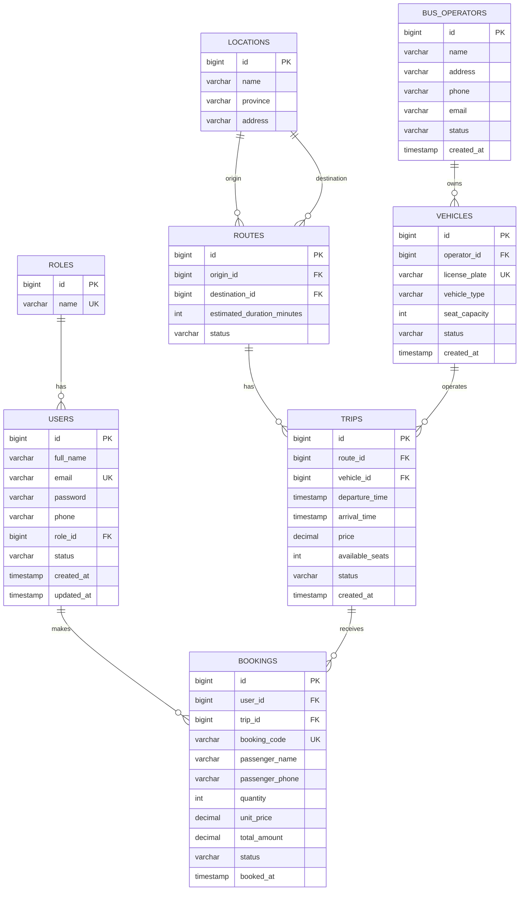

# 2. Thiết kế Database

## 2.1. Tổng quan Database

Hệ thống sử dụng cơ sở dữ liệu quan hệ để lưu trữ và quản lý thông tin người dùng, nhà xe, phương tiện, tuyến đường, chuyến xe và booking.

Database được thiết kế theo hướng chuẩn hóa dữ liệu, tách các thực thể có trách nhiệm khác nhau thành các bảng riêng biệt nhằm hạn chế dữ liệu trùng lặp và đảm bảo tính nhất quán.

Các thực thể chính của hệ thống gồm:

| Entity          | Mục đích                                      |
| --------------- | --------------------------------------------- |
| `roles`         | Lưu các vai trò của người dùng                |
| `users`         | Lưu thông tin tài khoản người dùng            |
| `bus_operators` | Lưu thông tin các nhà xe                      |
| `locations`     | Lưu các địa điểm được sử dụng làm điểm đi/đến |
| `vehicles`      | Lưu thông tin phương tiện                     |
| `routes`        | Lưu các tuyến đường                           |
| `trips`         | Lưu các chuyến xe cụ thể                      |
| `bookings`      | Lưu thông tin đặt vé                          |


---

## 2.2. ERD



---

## 2.3. Mô tả thực thể

### 2.3.1. `roles`

Lưu các vai trò được sử dụng để phân quyền người dùng.

| Column | Type        | Description |
| ------ | ----------- | ----------- |
| `id`   | BIGINT      | Khóa chính  |
| `name` | VARCHAR(30) | Tên vai trò |

Các giá trị dự kiến:

```text
USER
ADMIN
```

---

### 2.3.2. `users`

Lưu thông tin tài khoản người dùng.

| Column       | Type         | Description             |
| ------------ | ------------ | ----------------------- |
| `id`         | BIGINT       | Khóa chính              |
| `full_name`  | VARCHAR(100) | Họ và tên               |
| `email`      | VARCHAR(100) | Email đăng nhập         |
| `password`   | VARCHAR(255) | Mật khẩu đã được mã hóa |
| `phone`      | VARCHAR(20)  | Số điện thoại           |
| `role_id`    | BIGINT       | FK đến `roles`          |
| `status`     | VARCHAR(20)  | Trạng thái tài khoản    |
| `created_at` | TIMESTAMP    | Thời điểm tạo           |
| `updated_at` | TIMESTAMP    | Thời điểm cập nhật      |

---

### 2.3.3. `bus_operators`

Lưu thông tin các nhà xe.

| Column       | Type         | Description   |
| ------------ | ------------ | ------------- |
| `id`         | BIGINT       | Khóa chính    |
| `name`       | VARCHAR(150) | Tên nhà xe    |
| `address`    | VARCHAR(255) | Địa chỉ       |
| `phone`      | VARCHAR(20)  | Số điện thoại |
| `email`      | VARCHAR(100) | Email         |
| `status`     | VARCHAR(20)  | Trạng thái    |
| `created_at` | TIMESTAMP    | Thời điểm tạo |

---

### 2.3.4. `locations`

Lưu các địa điểm được sử dụng làm điểm đi hoặc điểm đến.

| Column     | Type         | Description    |
| ---------- | ------------ | -------------- |
| `id`       | BIGINT       | Khóa chính     |
| `name`     | VARCHAR(100) | Tên địa điểm   |
| `province` | VARCHAR(100) | Tỉnh/thành phố |
| `address`  | VARCHAR(255) | Địa chỉ        |

Ví dụ:

```text
Bến xe Mỹ Đình - Hà Nội
Bến xe Bãi Cháy - Quảng Ninh
Bến xe Việt Trì - Phú Thọ
```

---

### 2.3.5. `vehicles`

Lưu thông tin phương tiện thuộc các nhà xe.

| Column          | Type        | Description            |
| --------------- | ----------- | ---------------------- |
| `id`            | BIGINT      | Khóa chính             |
| `operator_id`   | BIGINT      | FK đến `bus_operators` |
| `license_plate` | VARCHAR(20) | Biển số xe             |
| `vehicle_type`  | VARCHAR(50) | Loại xe                |
| `seat_capacity` | INT         | Số ghế                 |
| `status`        | VARCHAR(20) | Trạng thái             |
| `created_at`    | TIMESTAMP   | Thời điểm tạo          |

---

### 2.3.6. `routes`

Lưu thông tin tuyến đường.

Một tuyến đường xác định điểm đi và điểm đến, ví dụ:

```text
Hà Nội → Hải Phòng
Hà Nội → Lạng Sơn
```

| Column                       | Type        | Description                 |
| ---------------------------- | ----------- | --------------------------- |
| `id`                         | BIGINT      | Khóa chính                  |
| `origin_id`                  | BIGINT      | FK đến `locations`          |
| `destination_id`             | BIGINT      | FK đến `locations`          |
| `estimated_duration_minutes` | INT         | Thời gian di chuyển dự kiến |
| `status`                     | VARCHAR(20) | Trạng thái tuyến            |

---

### 2.3.7. `trips`

Lưu thông tin của một chuyến xe cụ thể.

`routes` mô tả tuyến đường, trong khi `trips` mô tả một lần khởi hành cụ thể trên tuyến đó.

Ví dụ:

```text
Route:
Hà Nội → Hải Phòng

Trips:
06:00 - 10/10/2026
12:00 - 10/10/2026
20:00 - 10/10/2026
```

| Column            | Type          | Description           |
| ----------------- | ------------- | --------------------- |
| `id`              | BIGINT        | Khóa chính            |
| `route_id`        | BIGINT        | FK đến `routes`       |
| `vehicle_id`      | BIGINT        | FK đến `vehicles`     |
| `departure_time`  | TIMESTAMP     | Thời gian khởi hành   |
| `arrival_time`    | TIMESTAMP     | Thời gian dự kiến đến |
| `price`           | DECIMAL(12,2) | Giá vé                |
| `available_seats` | INT           | Số ghế còn trống      |
| `status`          | VARCHAR(20)   | Trạng thái chuyến     |
| `created_at`      | TIMESTAMP     | Thời điểm tạo         |

---

### 2.3.8. `bookings`

Lưu thông tin đặt vé của người dùng.

| Column            | Type          | Description                  |
| ----------------- | ------------- | ---------------------------- |
| `id`              | BIGINT        | Khóa chính                   |
| `user_id`         | BIGINT        | FK đến `users`               |
| `trip_id`         | BIGINT        | FK đến `trips`               |
| `booking_code`    | VARCHAR(30)   | Mã booking                   |
| `passenger_name`  | VARCHAR(100)  | Tên hành khách               |
| `passenger_phone` | VARCHAR(20)   | Số điện thoại hành khách     |
| `quantity`        | INT           | Số lượng vé                  |
| `unit_price`      | DECIMAL(12,2) | Giá một vé tại thời điểm đặt |
| `total_amount`    | DECIMAL(12,2) | Tổng tiền                    |
| `status`          | VARCHAR(30)   | Trạng thái booking           |
| `booked_at`       | TIMESTAMP     | Thời điểm đặt                |

Việc lưu `unit_price` và `total_amount` trong booking giúp giữ lại thông tin giá tại thời điểm đặt vé, thay vì phụ thuộc hoàn toàn vào giá hiện tại của chuyến xe.

---

## 2.4. Quan hệ dữ liệu

### 2.4.1. Role – User

```text
ROLES 1 ───────── N USERS
```

Một role có thể được gán cho nhiều user.

Một user có một role.

---

### 2.4.2. Bus Operator – Vehicle

```text
BUS_OPERATORS 1 ───────── N VEHICLES
```

Một nhà xe có thể quản lý nhiều phương tiện.

Mỗi phương tiện thuộc về một nhà xe.

---

### 2.4.3. Location – Route

```text
LOCATIONS 1 ───────── N ROUTES
       │
       ├── origin
       │
       └── destination
```

Một địa điểm có thể được sử dụng làm điểm đi của nhiều tuyến và cũng có thể được sử dụng làm điểm đến của nhiều tuyến.

Mỗi route có một điểm đi và một điểm đến.

---

### 2.4.4. Route – Trip

```text
ROUTES 1 ───────── N TRIPS
```

Một tuyến đường có thể có nhiều chuyến xe.

Mỗi chuyến xe thuộc một tuyến đường.

---

### 2.4.5. Vehicle – Trip

```text
VEHICLES 1 ───────── N TRIPS
```

Một phương tiện có thể được sử dụng cho nhiều chuyến xe ở các thời điểm khác nhau.

Mỗi chuyến xe sử dụng một phương tiện.

---

### 2.4.6. User – Booking

```text
USERS 1 ───────── N BOOKINGS
```

Một người dùng có thể tạo nhiều booking.

Mỗi booking thuộc về một người dùng.

---

### 2.4.7. Trip – Booking

```text
TRIPS 1 ───────── N BOOKINGS
```

Một chuyến xe có thể có nhiều booking.

Mỗi booking thuộc về một chuyến xe.

---

## 2.5. Constraints

Database sử dụng các ràng buộc để đảm bảo tính toàn vẹn của dữ liệu.

### 2.5.1. Primary Key

Mỗi bảng có một khóa chính:

```text
roles.id
users.id
bus_operators.id
locations.id
vehicles.id
routes.id
trips.id
bookings.id
```

Khóa chính đảm bảo mỗi bản ghi được định danh duy nhất.

### 2.5.2. Foreign Key

Các khóa ngoại chính:

```text
users.role_id
    → roles.id

vehicles.operator_id
    → bus_operators.id

routes.origin_id
    → locations.id

routes.destination_id
    → locations.id

trips.route_id
    → routes.id

trips.vehicle_id
    → vehicles.id

bookings.user_id
    → users.id

bookings.trip_id
    → trips.id
```

### 2.5.3. Unique Constraints

Các trường cần có giá trị duy nhất:

```text
roles.name
users.email
vehicles.license_plate
bookings.booking_code
```

### 2.5.4. Check Constraints

Một số điều kiện dữ liệu:

```text
vehicles.seat_capacity > 0

trips.price >= 0

trips.available_seats >= 0

bookings.quantity > 0

bookings.unit_price >= 0

bookings.total_amount >= 0

routes.origin_id <> routes.destination_id
```

### 2.5.5. Not Null

Các thông tin bắt buộc không được để trống, ví dụ:

```text
users.full_name
users.email
users.password
users.role_id

vehicles.operator_id
vehicles.license_plate
vehicles.seat_capacity

routes.origin_id
routes.destination_id

trips.route_id
trips.vehicle_id
trips.departure_time
trips.price

bookings.user_id
bookings.trip_id
bookings.booking_code
bookings.quantity
```

### 2.5.6. Business-level Constraints

Một số quy tắc được kiểm tra ở tầng nghiệp vụ thay vì chỉ bằng database constraint:

* Không được đặt số lượng vé lớn hơn số ghế còn trống.
* User chỉ được xem và hủy booking của chính mình.
* Không được đặt vé cho chuyến xe đã bị hủy hoặc không còn hoạt động.
* Khi booking thành công, số ghế còn trống phải được cập nhật.
* Khi booking được hủy hợp lệ, số ghế phải được hoàn lại.

Các quy tắc này thuộc nghiệp vụ và sẽ được xử lý tại Business Layer.

---

## 2.6. Indexes

Database sử dụng index cho các trường thường xuyên được sử dụng trong tìm kiếm hoặc truy vấn quan hệ.

### 2.6.1. User

```text
UNIQUE INDEX: users.email
```

Email được sử dụng khi đăng nhập và phải duy nhất.

---

### 2.6.2. Vehicle

```text
UNIQUE INDEX: vehicles.license_plate
```

Biển số xe phải duy nhất trong hệ thống.

---

### 2.6.3. Booking

```text
UNIQUE INDEX: bookings.booking_code
```

Mã booking được sử dụng để xác định một booking.

Có thể bổ sung:

```text
INDEX: bookings.user_id
INDEX: bookings.trip_id
```

để hỗ trợ:

* Lấy lịch sử booking của một user.
* Lấy các booking của một chuyến xe.

---

### 2.6.4. Trip

Các trường thường được sử dụng khi tìm kiếm chuyến xe:

```text
INDEX: trips.route_id
INDEX: trips.departure_time
```

Có thể sử dụng composite index cho các truy vấn tìm chuyến theo tuyến và thời gian:

```text
INDEX: (route_id, departure_time)
```

---

### 2.6.5. Route

Các khóa ngoại:

```text
INDEX: routes.origin_id
INDEX: routes.destination_id
```

hỗ trợ tìm kiếm các tuyến theo điểm đi và điểm đến.

---

### 2.6.6. Nguyên tắc sử dụng Index

Index chỉ được tạo cho các trường có tần suất truy vấn phù hợp.

Trong Pha 1, hệ thống không thực hiện tối ưu hóa database ở mức phức tạp. Các index sẽ tập trung vào:

* Các trường `UNIQUE`.
* Các khóa ngoại thường xuyên được truy vấn.
* Các trường phục vụ chức năng tìm kiếm chuyến xe.
* Các trường phục vụ truy vấn booking của người dùng.
