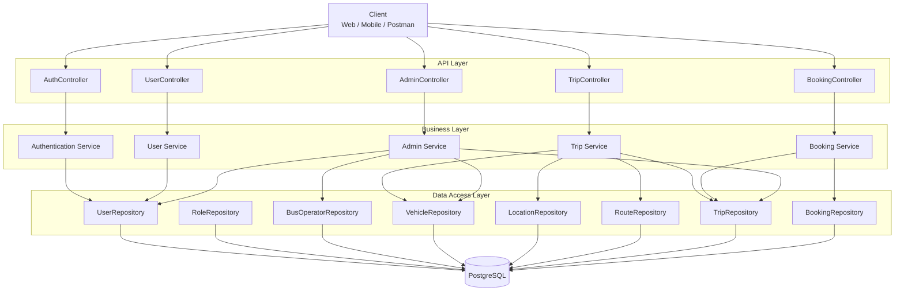

# 3. Kiến trúc hệ thống

## 3.1. Tổng quan kiến trúc

Hệ thống đặt vé xe khách được xây dựng theo kiến trúc phân tầng (Layered Architecture), trong đó các thành phần được tổ chức thành các tầng có trách nhiệm riêng biệt.

Kiến trúc tổng quát:

```text
┌──────────────────────────────────────────────┐
│                    CLIENT                    │
│             Web / Mobile / Postman           │
└──────────────────────┬───────────────────────┘
                       │
                    HTTP/JSON
                       │
                       ▼
┌──────────────────────────────────────────────┐
│                  API LAYER                   │
│                                              │
│  AuthController                              │
│  UserController                              │
│  TripController                              │
│  BookingController                           │
│  AdminController                             │
└──────────────────────┬───────────────────────┘
                       │
                       ▼
┌──────────────────────────────────────────────┐
│               BUSINESS LAYER                 │
│                                              │
│  Authentication                              │
│  User Management                             │
│  Trip Management                             │
│  Booking Management                          │
│  Business Rules                              │
└──────────────────────┬───────────────────────┘
                       │
                       ▼
┌──────────────────────────────────────────────┐
│              DATA ACCESS LAYER               │
│                                              │
│  UserRepository                              │
│  TripRepository                              │
│  BookingRepository                           │
│  VehicleRepository                           │
│  ...                                         │
└──────────────────────┬───────────────────────┘
                       │
                       ▼
┌──────────────────────────────────────────────┐
│                  DATABASE                    │
│                 PostgreSQL                   │
└──────────────────────────────────────────────┘
```

Client giao tiếp với hệ thống thông qua REST API sử dụng JSON.

API Layer tiếp nhận và xử lý HTTP request, sau đó chuyển yêu cầu đến Business Layer.

Business Layer thực hiện các nghiệp vụ và business rules của hệ thống.

Data Access Layer chịu trách nhiệm giao tiếp với cơ sở dữ liệu thông qua Repository/ORM.

Cách tổ chức này giúp tách biệt trách nhiệm giữa các thành phần và tạo điều kiện thuận lợi cho việc kiểm thử, bảo trì và mở rộng hệ thống.

---

## 3.2. Kiểu kiến trúc

Hệ thống sử dụng **kiến trúc phân lớp** kết hợp với mô hình **RESTful API**.

### Kiến trúc phân lớp

Các thành phần được chia thành ba tầng chính:

```text
API Layer
    ↓
Business Layer
    ↓
Data Access Layer
```

Mỗi tầng chỉ đảm nhận trách nhiệm thuộc phạm vi của mình.

### RESTful API

Hệ thống cung cấp REST API để client giao tiếp với backend.

Các đặc điểm chính:

* Sử dụng HTTP.
* Trao đổi dữ liệu dưới dạng JSON.
* Sử dụng HTTP methods phù hợp với thao tác.
* Sử dụng HTTP status codes để biểu diễn kết quả xử lý.
* API không phụ thuộc vào giao diện người dùng cụ thể.

Ví dụ:

```text
GET    /api/trips
POST   /api/bookings
GET    /api/bookings/my
DELETE /api/bookings/{id}
```

### Dependency Direction

Dependency giữa các tầng được tổ chức theo một hướng:

```text
API
 ↓
Business
 ↓
Data Access
 ↓
Database
```

Business Layer không trực tiếp phụ thuộc vào HTTP request/response hoặc các API cụ thể của database.

---

## 3.3. Layered Architecture

Hệ thống được chia thành ba tầng chính:

```text
┌────────────────────────────────────┐
│             API LAYER              │
│        Controllers / DTOs          │
└──────────────────┬─────────────────┘
                   │
                   ▼
┌────────────────────────────────────┐
│          BUSINESS LAYER            │
│      Services / Domain Logic       │
└──────────────────┬─────────────────┘
                   │
                   ▼
┌────────────────────────────────────┐
│        DATA ACCESS LAYER           │
│          Repositories              │
└──────────────────┬─────────────────┘
                   │
                   ▼
              PostgreSQL
```

### API Layer

Chịu trách nhiệm tiếp nhận request từ client và trả response.

Không nên chứa các business rules phức tạp.

### Business Layer

Chịu trách nhiệm xử lý nghiệp vụ của hệ thống.

Ví dụ:

* Kiểm tra số ghế còn trống.
* Kiểm tra quyền sở hữu booking.
* Tạo booking.
* Cập nhật số ghế.
* Kiểm tra trạng thái chuyến xe.

Đây là tầng trung tâm của hệ thống.

### Data Access Layer

Chịu trách nhiệm truy cập và thao tác với dữ liệu.

Tầng này sử dụng Repository và ORM để giao tiếp với PostgreSQL.

---

## 3.4. Component Diagram

Các component chính của hệ thống:



Luồng xử lý tổng quát:

```text
Client
  ↓
Controller
  ↓
Service
  ↓
Repository
  ↓
PostgreSQL
```

Ví dụ với chức năng đặt vé:

```text
POST /api/bookings
        ↓
BookingController
        ↓
BookingService
        ↓
 ┌─────────────────────────┐
 │ Kiểm tra user           │
 │ Kiểm tra trip           │
 │ Kiểm tra số ghế         │
 │ Tạo booking             │
 │ Cập nhật số ghế         │
 └────────────┬────────────┘
              ↓
      BookingRepository
              ↓
         PostgreSQL
```

---

## 3.5. Layer Responsibilities

### API Layer

API Layer là điểm giao tiếp giữa client và hệ thống.

#### Trách nhiệm

* Tiếp nhận HTTP request.
* Validate các input cơ bản.
* Chuyển request data thành đối tượng phù hợp.
* Gọi Business Layer.
* Chuyển kết quả nghiệp vụ thành HTTP response.
* Xử lý các HTTP status code phù hợp.
* Cung cấp REST endpoint.

Ví dụ:

```text
BookingController
    ↓
POST /api/bookings
    ↓
BookingService.createBooking(...)
```

#### Không nên thực hiện

API Layer không nên chứa:

* Business rules phức tạp.
* Logic truy cập database trực tiếp.
* Logic cập nhật nhiều entity nghiệp vụ.

---

### Business Layer

Business Layer chịu trách nhiệm thực hiện các nghiệp vụ của hệ thống.

Các service chính có thể gồm:

```text
AuthService
UserService
TripService
BookingService
AdminService
```

#### Trách nhiệm

* Thực hiện business rules.
* Kiểm tra điều kiện nghiệp vụ.
* Điều phối nhiều thao tác dữ liệu.
* Xử lý transaction nghiệp vụ.
* Gọi Data Access Layer.
* Phát sinh các lỗi nghiệp vụ phù hợp.

Ví dụ đối với booking:

```text
BookingService
    │
    ├── Kiểm tra user
    ├── Tìm trip
    ├── Kiểm tra trạng thái trip
    ├── Kiểm tra available seats
    ├── Tạo booking
    └── Cập nhật available seats
```

#### Dependency Rule

Business Layer **không import hoặc phụ thuộc trực tiếp vào Web Framework hay Database Library**.

Business logic cần được giữ độc lập với:

* HTTP.
* Controller.
* PostgreSQL.
* JPA implementation.
* Các chi tiết triển khai của framework.

Điều này giúp business logic dễ kiểm thử và giảm sự phụ thuộc vào công nghệ cụ thể.

---

### Data Access Layer

Data Access Layer chịu trách nhiệm giao tiếp với database.

Các repository dự kiến:

```text
UserRepository
RoleRepository
BusOperatorRepository
VehicleRepository
LocationRepository
RouteRepository
TripRepository
BookingRepository
```

#### Trách nhiệm

* Truy vấn dữ liệu.
* Thêm dữ liệu.
* Cập nhật dữ liệu.
* Xóa dữ liệu.
* Tìm kiếm dữ liệu theo điều kiện.
* Ánh xạ dữ liệu giữa application và database.

Data Access Layer sử dụng ORM/Data Mapper để thực hiện việc truy cập PostgreSQL.

#### Không nên thực hiện

Data Access Layer không chịu trách nhiệm:

* Xử lý HTTP request.
* Xác thực người dùng ở mức endpoint.
* Quyết định các business rules.
* Xử lý logic giao diện.

---

## 3.6. Authentication Architecture

Hệ thống sử dụng cơ chế xác thực dựa trên token.

Luồng xác thực tổng quát:

```text
┌──────────────┐
│    Client    │
└──────┬───────┘
       │
       │ Login
       ▼
┌──────────────────┐
│ Auth Controller  │
└────────┬─────────┘
         │
         ▼
┌──────────────────┐
│ Authentication   │
│ Service          │
└────────┬─────────┘
         │
         ▼
    Verify User
         │
         ▼
   Generate Token
         │
         ▼
       Client
```

Sau khi đăng nhập, client gửi token trong các request cần xác thực:

```text
Authorization: Bearer <token>
```

### Request có xác thực

```text
Client
  │
  │ Authorization: Bearer <token>
  ▼
Authentication Filter
  │
  ├── Token hợp lệ
  │       ↓
  │    Security Context
  │       ↓
  │    Controller
  │
  └── Token không hợp lệ
          ↓
      Unauthorized
```

Việc xác thực được thực hiện ở **middleware/filter/security layer** thay vì lặp lại logic xác thực trong từng controller.

### Authorization

Sau khi xác thực thành công, hệ thống sử dụng role của người dùng để kiểm soát quyền truy cập.

```text
USER
 ├── Search trips
 ├── Create booking
 ├── View own bookings
 └── Cancel own booking

ADMIN
 ├── Manage users
 ├── Manage operators
 ├── Manage vehicles
 ├── Manage routes
 ├── Manage trips
 └── Manage bookings
```

Business Layer vẫn kiểm tra các điều kiện nghiệp vụ liên quan đến quyền sở hữu dữ liệu.

Ví dụ:

```text
User A
  ↓
GET /api/bookings/100
  ↓
Kiểm tra booking 100 thuộc User A?
  ↓
Có → cho phép
Không → từ chối
```

---

## 3.7. Deployment Architecture

Trong Pha 1, hệ thống được đóng gói bằng Docker để tạo môi trường triển khai nhất quán.

Kiến trúc triển khai cơ bản:

```text
┌─────────────────────────┐
│         Client          │
│   Web / Postman / ...   │
└────────────┬────────────┘
             │
             │ HTTP
             ▼
┌─────────────────────────┐
│    Spring Boot App      │
│                         │
│  REST API               │
│  Business Logic         │
│  Data Access            │
└────────────┬────────────┘
             │
             │ JDBC
             ▼
┌─────────────────────────┐
│      PostgreSQL         │
│                         │
│     Database            │
└─────────────────────────┘
```

Khi sử dụng Docker Compose:

```text
┌───────────────────────────────────────────┐
│              Docker Host                  │
│                                           │
│  ┌─────────────────┐  ┌────────────────┐  │
│  │ Backend         │  │ PostgreSQL     │  │
│  │ Spring Boot     │──│ Database       │  │
│  │ Container       │  │ Container      │  │
│  └─────────────────┘  └────────────────┘  │
│                                           │
└───────────────────────────────────────────┘
          ▲
          │
          │ HTTP
          │
       Client
```

### Backend Container

Chứa ứng dụng Spring Boot và cung cấp REST API cho client.

### PostgreSQL Container

Chứa cơ sở dữ liệu của hệ thống.

### Docker Compose

Docker Compose được sử dụng để định nghĩa và khởi chạy các service cần thiết cho hệ thống.

Ví dụ:

```text
docker compose up --build
```

sẽ khởi chạy môi trường backend và database.

### Deployment Flow

```text
Source Code
     ↓
Build Application
     ↓
Build Docker Image
     ↓
Start Containers
     ↓
Spring Boot Application
     ↓
PostgreSQL
```

Kiến trúc triển khai này phục vụ mục tiêu của Pha 1 là đảm bảo hệ thống có thể được đóng gói và chạy trong môi trường nhất quán. Các cơ chế triển khai nâng cao như CI/CD, load balancing, container orchestration hoặc cloud deployment chưa thuộc phạm vi của Pha 1.
